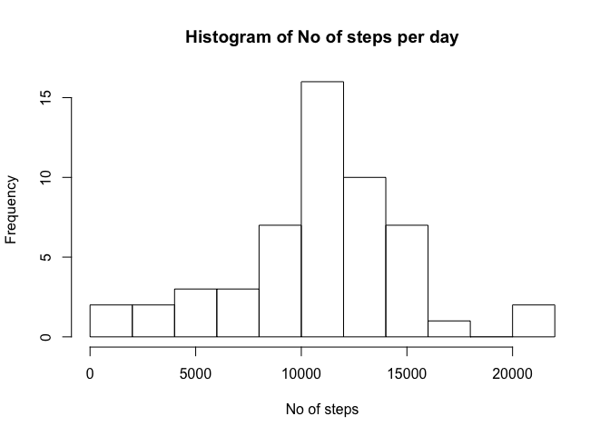
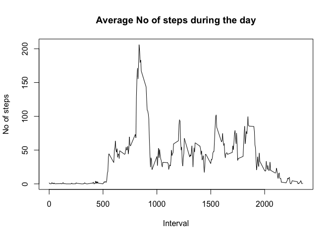
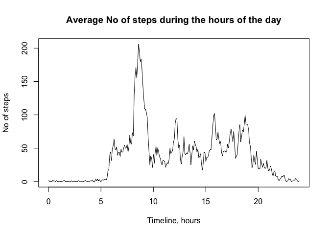
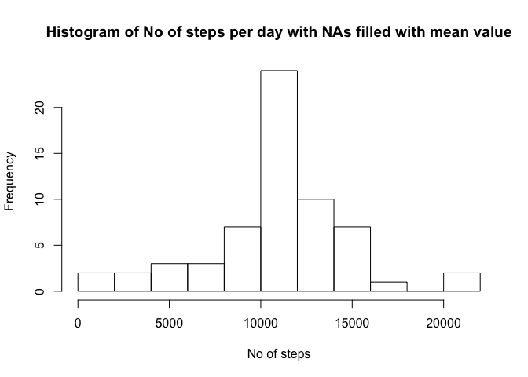

# Reproducible Research: Peer Assessment 1

This assessment is done on the dataset from a personal activity monitoring device. This device collects data at 5 minute intervals through out the day. The data consists of two months of data from an anonymous individual collected during the months of October and November, 2012 and include the number of steps taken in 5 minute intervals each day.

## Loading and preprocessing the data
  
Loading the dataset:  


```r
dataset <- read.csv(file="activity.csv", head=TRUE, sep=',');
```

In this dataset we have the following variables and first rows:


```r
head(dataset, 10);
```

```
##    steps       date interval
## 1     NA 2012-10-01        0
## 2     NA 2012-10-01        5
## 3     NA 2012-10-01       10
## 4     NA 2012-10-01       15
## 5     NA 2012-10-01       20
## 6     NA 2012-10-01       25
## 7     NA 2012-10-01       30
## 8     NA 2012-10-01       35
## 9     NA 2012-10-01       40
## 10    NA 2012-10-01       45
```

Steps column contains a lot of missing (N/A) values, we can ignoge this for the next step. 


## What is mean total number of steps taken per day?

For this task we can use ?aggregate function to group steps by date and apply ?sum function. Building a histogram on No of steps every day for two months helps to visualize the data. In stepsCount table x represents No of steps per day, No of cells in histogram is 10:


```r
stepsCount <- aggregate(dataset$steps, by = list(date = dataset$date), FUN = sum);
head(stepsCount, 10);
```

```
##          date     x
## 1  2012-10-01    NA
## 2  2012-10-02   126
## 3  2012-10-03 11352
## 4  2012-10-04 12116
## 5  2012-10-05 13294
## 6  2012-10-06 15420
## 7  2012-10-07 11015
## 8  2012-10-08    NA
## 9  2012-10-09 12811
## 10 2012-10-10  9900
```

```r
hist(stepsCount$x, breaks = 10, main="Histogram of No of steps per day", xlab="No of steps");
```

 

Calculating mean and median of the total number of steps taken per day (need to exclude N/As here):


```r
mean <- mean(stepsCount$x, na.rm=TRUE);
median <- median(stepsCount$x, na.rm=TRUE);
mean;
```

```
## [1] 10766
```

```r
median;
```

```
## [1] 10765
```

## What is the average daily activity pattern?

Aggregating dataset by intervals to a new dataframe (timeLapse) and applying ?mean function to count the average No of steps for each interval. Linear plot displays average No of steps during the day by time intervals.


```r
timeLapse <- aggregate(dataset$steps, by = list(interval = dataset$interval), FUN = mean, na.rm = TRUE);
plot(timeLapse, main = "Average No of steps during the day", xlab = "Interval", ylab = "No of steps", type = "l");
```

 

To make the graph more readable, let's rename interval codes to the real time during the day in hours. Create a timeline vector (with intervals every 5 min, in hours), add it to the timeLapse table and make a plot. 10PM-5.30AM looks like sleeping time, and 8-10AM is a running time :)


```r
timeLine <- c(seq(length = 288, from = 0, by = 0.0833333));
timeLapse$TimeLine <- timeLine;
plot(timeLapse$TimeLine, timeLapse$x, main = "Average No of steps during the hours of the day", xlab = "Timeline, hours", ylab = "No of steps", type = "l");
```

 

## Imputing missing values

Calculate and report the total number of missing values in the dataset (i.e. the total number of rows with NAs)


```r
sum(is.na(dataset$steps));
```

```
## [1] 2304
```


Calculate mean number of steps for 5 min interval (using aggregated timeLapse table), then create a function to fill NAs in "steps" with this mean value. Add filled steps column to original dataset to compare results and then create new dataset for further calculations:


```r
meanStepsForInterval <- mean(timeLapse$x);
meanStepsForInterval;
```

```
## [1] 37.38
```

```r
replaceNAs <- function(x) {
  if (is.na(x)) {
    x <- meanStepsForInterval;
  }
  else x <- x;
}
filledSteps <- lapply(dataset$steps, replaceNAs);
filledStepsNumeric <- as.numeric(filledSteps);
dataset$filledSteps <- filledStepsNumeric;
head(dataset, 10);
```

```
##    steps       date interval filledSteps
## 1     NA 2012-10-01        0       37.38
## 2     NA 2012-10-01        5       37.38
## 3     NA 2012-10-01       10       37.38
## 4     NA 2012-10-01       15       37.38
## 5     NA 2012-10-01       20       37.38
## 6     NA 2012-10-01       25       37.38
## 7     NA 2012-10-01       30       37.38
## 8     NA 2012-10-01       35       37.38
## 9     NA 2012-10-01       40       37.38
## 10    NA 2012-10-01       45       37.38
```

```r
filledDataset <- data.frame(dataset[4], dataset[2], dataset[3]);
head(filledDataset);
```

```
##   filledSteps       date interval
## 1       37.38 2012-10-01        0
## 2       37.38 2012-10-01        5
## 3       37.38 2012-10-01       10
## 4       37.38 2012-10-01       15
## 5       37.38 2012-10-01       20
## 6       37.38 2012-10-01       25
```

  
Build a histogram, compare to original one and calculate new mean and median values:


```r
stepsCountFilled <- aggregate(filledDataset$filledSteps, by = list(date = filledDataset$date), FUN = sum);

hist(stepsCountFilled$x, breaks = 8, main="Histogram of No of steps per day with NAs filled with mean value", xlab="No of steps");
```

 

```r
##compare to the first histogram:
hist(stepsCount$x, breaks = 8, main="Histogram of No of steps per day", xlab="No of steps");
```

 


```r
##calculate mean and median for filled data:
meanFilled <- mean(stepsCountFilled$x, na.rm=TRUE);
medianFilled <- median(stepsCountFilled$x, na.rm=TRUE);
meanFilled;
```

```
## [1] 10766
```

```r
medianFilled;
```

```
## [1] 10766
```

Compare to not filled values:


```r
mean;
```

```
## [1] 10766
```

```r
median;
```

```
## [1] 10765
```

So we can see that mean and median value stays almost the same (which is logical, because NAs were filled with mean value!), but histogram comparison shows fewer cases of low/extra high steps per day and more cases of median activity.

## Are there differences in activity patterns between weekdays and weekends?

Add a new factor variable with "weekday" and "weekend" levels.


```r
filledDataset$day <- weekdays(as.Date(filledDataset$date))
head(filledDataset);
```

```
##   filledSteps       date interval    day
## 1       37.38 2012-10-01        0 Monday
## 2       37.38 2012-10-01        5 Monday
## 3       37.38 2012-10-01       10 Monday
## 4       37.38 2012-10-01       15 Monday
## 5       37.38 2012-10-01       20 Monday
## 6       37.38 2012-10-01       25 Monday
```

```r
##change days to "weekday" and "weekend"levels:
##create function:
replaceDays <- function(x) {
  if ( (x == "Saturday") | (x == "Sunday")) {
    x <- "weekend";
  }
  else x <- "weekday";
}

##replace - apply function to "day" column and add resulting vector to the filledDataset:
replacedDays <- lapply(filledDataset$day, replaceDays);
filledDataset$replacedDays <- replacedDays

## show head of resulting table:
head(filledDataset);
```

```
##   filledSteps       date interval    day replacedDays
## 1       37.38 2012-10-01        0 Monday      weekday
## 2       37.38 2012-10-01        5 Monday      weekday
## 3       37.38 2012-10-01       10 Monday      weekday
## 4       37.38 2012-10-01       15 Monday      weekday
## 5       37.38 2012-10-01       20 Monday      weekday
## 6       37.38 2012-10-01       25 Monday      weekday
```

And build panel plot for weekdays and weekends (aggegate and add timeline first, as in previous step for linear graph):


Unfortunately, I didn't have enough time to finish this last task :( 

